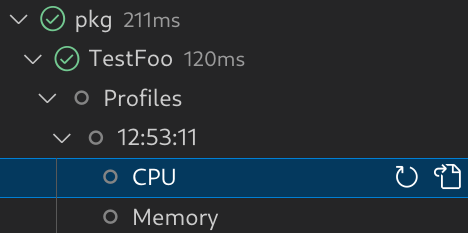

# Go Companion

An unofficial companion to the [official Go extension][vscode-go] that provides
experimental features.

[vscode-go]: https://marketplace.visualstudio.com/items?itemName=golang.go

## Test Explorer

Go Companion includes an experimental alternative to vscode-go's test explorer
that uses the Go language server (gopls) for test discovery, allowing for more
advanced test discovery such as static detection of (some) subtests.
Additionally, Go Companion provides the following features:

-   Ignore tests within specified files.
-   Disable automatic discovery of tests.
-   Control how tests are displayed.
-   Debugging a test updates its status in the test explorer.
-   Support for continuous runs.
-   Code lenses (hidden by default) that are integrated with the test explorer.

See [settings](./docs/settings.md) for more details.

## Profiling

Go Companion supports profiling tests and includes a pprof profile viewer that
is more cleanly integrated with the editor than vscode-go's iframe-based viewer.
To profile tests:

1. Run `Configure Test Profiles`
2. Select `Run - Go (experimental)`
3. Select `Profiling`
4. Select the profiles you wish to capture
5. Hit `[Enter]` to save your selection
6. Run a test
7. There will now be a `Profiles` item under the test
8. Open `Profiles`
9. Open the profile set, e.g. `12:34:56`
10. Open the profile, e.g. `CPU`, by double clicking the item or clicking the open symbol

If multiple tests are run with profiling enabled, `Profiles` will appear under
the package instead of the individual test.

## Documentation Viewer (**TODO**)

I plan to add an in-editor documentation viewer such that you can view
documentation for your code similar to what you would see on pkg.go.dev.
