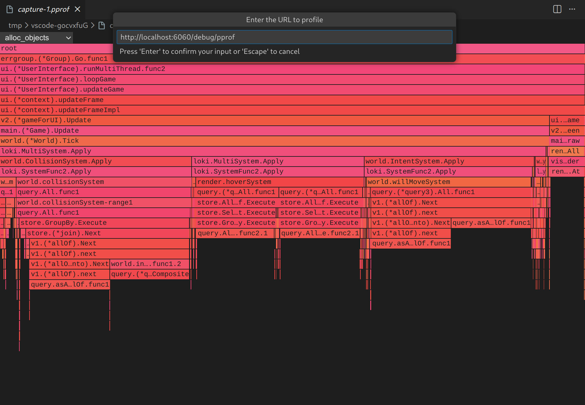
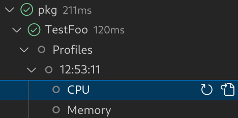
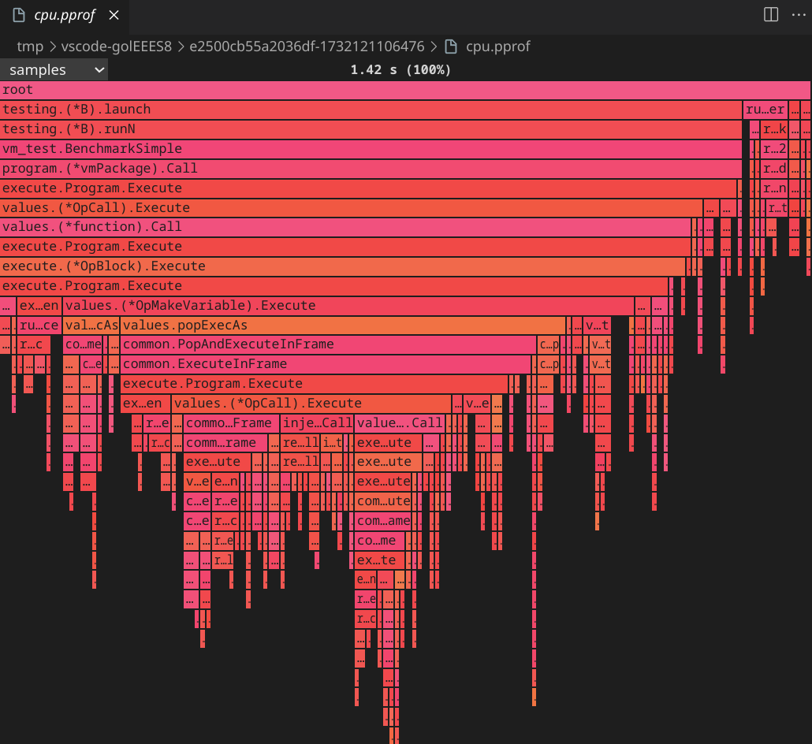
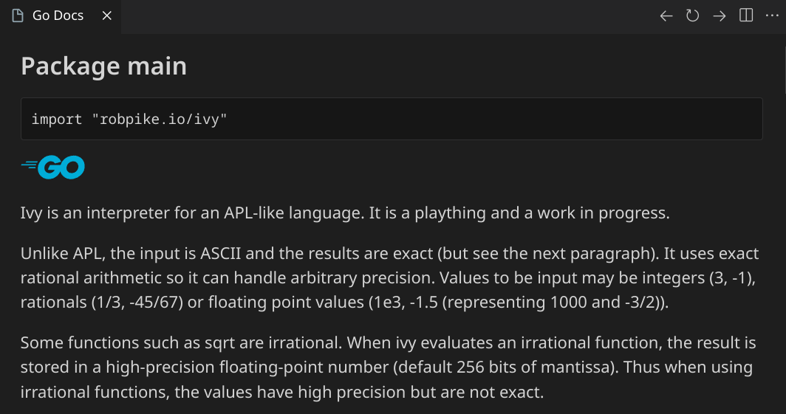

# Go Companion

The [unofficial companion][vscode-go-companion] to the [official Go
extension][vscode-go-ms] that provides experimental features.

**Go Companion is intended to be used with *prerelease* versions of the Go
extension and requires gopls v0.17.0 or later.** The user experience may be
somewhat degraded when used with release versions of the Go extension.

[vscode-go-ms]: https://marketplace.visualstudio.com/items?itemName=golang.go
[vscode-go-companion]: https://marketplace.visualstudio.com/items?itemName=ethan-reesor.exp-vscode-go

## Releases

Releases are done automatically through GitHub Actions based on git tags (see
[publish.yml][publish]). The tag must match the package.json version. If the
minor version number is even, it will be published as a prerelease.

[publish]: ./.github/workflows/publish.yml

## Issues

Report issues to [github.com/firelizzard18/exp-vscode-go][issues].

[issues]: https://github.com/firelizzard18/exp-vscode-go/issues/new/choose

## Test Explorer

Go Companion includes an experimental alternative to vscode-go's test explorer
that uses the Go language server (gopls) for test discovery, allowing for more
advanced test discovery such as static detection of (some) subtests.
Additionally, Go Companion provides the following features:

-   Ignore tests within specified files.
-   Disable automatic discovery of tests.
-   Control how tests are displayed.
-   Debugging a test updates its status in the test explorer.
-   Support for continuous runs.
-   Code lenses (hidden by default) that are integrated with the test explorer.

More detailed descriptions of these settings are provided in VSCode's settings
editor.

### Coverage

Coverage is supported through VSCode's test coverage API. The coverage scope (as
in, show coverage for the current package or for the entire module) may be
configured with the "Configure Coverage Run Profile" command. This is a
workaround for microsoft/vscode#237106.

## Profiling

Go Companion supports profiling processes and tests and includes a pprof profile viewer that
is more cleanly integrated with the editor than vscode-go's iframe-based viewer.

### Profiling a process

1. Run the command `Go Companion: Capture Profile`
2. Enter a URL of a `net/http/pprof` handler, e.g.
   `http://localhost:6060/debug/pprof/heap`.
3. Once the profile is captured it will be opened. CPU profiles take time to
   capture, the others should be instant.

If the URL ends with `/debug/pprof`, you will be prompted to select the type of
profile that should be captured.

### Profiling a test

1. Run the command `Test: Configure Test Profiles`
2. Select `Run - Go (experimental)`
3. Select `Profiling`
4. Select the profiles you wish to capture
5. Hit `[Enter]` to save your selection
6. Run a test
7. There will now be a `Profiles` item under the test
8. Open `Profiles`
9. Open the profile set, e.g. `12:34:56`
10. Open the profile, e.g. `CPU`, by double clicking the item or clicking the open symbol

If multiple tests are run with profiling enabled, `Profiles` will appear under
the package instead of the individual test.

## Documentation Viewer

Go Companion provides a command and editor context menu item for rendering
package documentation. Right click a declaration in a Go file and select "Go
Companion: Render Documentation":

